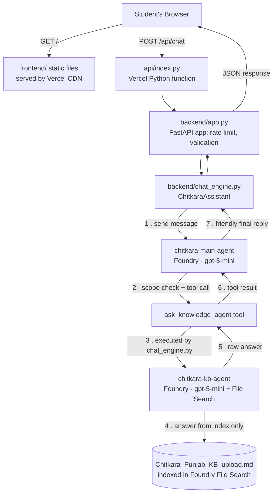

# UniAssist-Ai — Chitkara University FAQ Chatbot

**Live app:** https://chitkara-faq.vercel.app
**Repo:** https://github.com/AashnaTyagi/chitkara-faq

A two-agent FAQ chatbot for Chitkara University, Punjab, built on **Microsoft Foundry Agent Service**.
It answers *only* from a curated university knowledge base — no open web search, no hallucinated
answers outside its scope.

---

## Table of contents

- [What this project does](#what-this-project-does)
- [Architecture](#architecture)
- [How the two-agent system works](#how-the-two-agent-system-works)
- [Tech stack](#tech-stack)
- [Project structure](#project-structure)
- [Planning / build stages](#planning--build-stages)
- [Run locally](#run-locally-windows-cmd)
- [Deploy to Vercel](#deploy-to-vercel-current-production-setup)
- [Deploy to Render (alternative)](#deploy-to-render-alternative)
- [Cost guardrails](#cost-guardrails)
- [Roadmap / possible next steps](#roadmap--possible-next-steps)

---

## What this project does

Students ask questions about Chitkara University (admissions, fees, hostel, exams, etc.) in a plain
chat UI. The question is handled by a **main agent**, which — if it's actually about the university —
hands it off to a **knowledge-base agent** that can only answer from one indexed document. The main
agent then turns that raw answer into a friendly, formatted reply. If a question is out of scope
(not about the university), the main agent declines instead of guessing.

There is **no local database**. All "memory" of facts lives inside Microsoft Foundry as an indexed
file, and all conversation state for a single chat lives in Foundry's own conversation objects — the
FastAPI backend is a thin, stateless relay. This is why the same deployment works identically
whether it's opened from a phone, a laptop, or any browser anywhere — there is nothing local to sync.

## Architecture



**Why it works "everywhere" with no local DB:** the knowledge base document is uploaded once into
Foundry's File Search index (a one-time setup step), and both agents live inside Foundry permanently.
Every deployment (local, Render, Vercel, or anywhere else) just needs network access to the Foundry
endpoint plus valid Entra ID credentials — it never touches a local file or database at runtime.

## How the two-agent system works

| Step | Component | Responsibility |
|---|---|---|
| 1 | **Frontend** (`frontend/`) | Plain HTML/CSS/JS chat widget. No framework, no build step. Sends `POST /api/chat` with `{message, conversation_id}`. |
| 2 | **FastAPI backend** (`backend/app.py`) | Validates input, rate-limits per visitor IP (in-memory, resets per function instance on Vercel), and calls the assistant. |
| 3 | **chat_engine.py** | Wraps the Foundry SDK. Creates/reuses a conversation, sends the user's message to the **main agent**, and executes any tool calls the main agent makes. |
| 4 | **chitkara-main-agent** (Foundry) | Reads `main_agent_instructions.txt`. Its jobs: (a) decide if the question is in scope for Chitkara University, (b) rewrite vague follow-ups into standalone questions, (c) call the `ask_knowledge_agent` function tool to get facts, (d) turn the raw KB answer into a warm, well-formatted reply. It never answers facts itself — it always defers to the KB agent for anything factual. |
| 5 | **ask_knowledge_agent tool** | A function tool defined in the main agent's config; when called, `chat_engine.py` intercepts it and forwards the question to the KB agent. |
| 6 | **chitkara-kb-agent** (Foundry) | Has **File Search** enabled over exactly one indexed file: `knowledge-base/Chitkara_Punjab_KB_upload.md`. It cannot browse the web or use outside knowledge — answers are grounded strictly in that document. |
| 7 | **Response assembly** | The KB agent's answer returns to the main agent as a tool result → the main agent composes the final reply → `chat_engine.py` returns `{answer, kb_calls}` → FastAPI returns it as JSON → frontend renders it as markdown. |

`SHOW_AGENT_TRACE=true` exposes the exact question sent to the KB agent for each answer (`kb_calls`
in the response), which is useful for debugging or demonstrating the hand-off during a viva/demo.

## Tech stack

- **AI orchestration:** Microsoft Foundry Agent Service (two agents, `gpt-5-mini`, File Search tool)
- **Backend:** Python, FastAPI, `azure-ai-projects` SDK, `azure-identity` (Entra ID auth)
- **Frontend:** Vanilla HTML/CSS/JS, `marked.min.js` (markdown rendering), `purify.min.js` (XSS sanitizing)
- **Hosting:** Vercel (production) — static frontend via CDN + Python serverless function for `/api/*`
- **Auth to Foundry:** Microsoft Entra ID service principal (`azure-identity`'s `DefaultAzureCredential`), not an API key — Foundry Agent Service doesn't support key-based auth
- **No database:** knowledge lives in Foundry's File Search index; conversation state lives in Foundry conversation objects; rate limiting is in-memory per function instance

## Project structure

```
chitkara-faq/
├── api/
│   └── index.py              # Vercel entrypoint — imports backend/app.py's FastAPI app
├── backend/
│   ├── app.py                 # FastAPI routes: /api/chat, /api/health
│   ├── chat_engine.py          # Two-agent orchestration logic
│   ├── setup_main_agent.py     # One-time/on-change script to create/update the main agent in Foundry
│   ├── cli_chat.py             # Terminal chat client for local testing/debugging
│   ├── main_agent_instructions.txt  # System prompt for chitkara-main-agent
│   ├── requirements.txt
│   └── .env.example
├── frontend/
│   ├── index.html
│   ├── app.js
│   ├── styles.css
│   ├── logo.png
│   └── vendor/                 # marked.min.js, purify.min.js (no CDN dependency)
├── knowledge-base/
│   └── Chitkara_Punjab_KB_upload.md   # Source document indexed by the KB agent's File Search
├── vercel.json                  # Routes /api/* to api/index.py, serves frontend/ as static output
├── render.yaml                  # Alternative deployment target (Render Blueprint)
├── requirements.txt
└── README.md
```

## Planning / build stages

This is roughly the order the project was actually built and deployed in:

1. **Knowledge base prep** — Wrote/curated `Chitkara_Punjab_KB_upload.md` covering admissions, fees,
   hostel, academics, etc. for Chitkara University, Punjab.
2. **Foundry project setup** — Created the `uniassist-resource` Foundry resource and project;
   uploaded the KB file and configured `chitkara-kb-agent` with File Search scoped to it.
3. **Main agent design** — Wrote `main_agent_instructions.txt` to define scope-guarding behaviour,
   follow-up rewriting, and the `ask_knowledge_agent` tool contract; built `chitkara-main-agent` via
   `setup_main_agent.py`.
4. **Backend** — Built `chat_engine.py` (agent orchestration) and `app.py` (FastAPI wrapper: routes,
   validation, per-IP rate limiting) so the two-agent logic is reusable from both a CLI (`cli_chat.py`)
   and a web API.
5. **Frontend** — Plain HTML/CSS/JS chat UI with no build step, so it can be served as static files
   with zero extra tooling.
6. **Local verification** — Ran everything locally via `az login` + `uvicorn app:app --reload` to
   confirm the full chain (frontend → API → main agent → tool call → KB agent → File Search → back)
   worked before deploying anywhere.
7. **GitHub** — Pushed the project to `github.com/AashnaTyagi/chitkara-faq`.
8. **Vercel deployment** —
   - Imported the repo into Vercel.
   - Created an Entra ID **service principal** (`az ad sp create-for-rbac`) since Foundry doesn't
     accept API keys, and assigned it the **Foundry User** role (formerly "Azure AI User") on the
     `uniassist-resource` scope.
   - Set all required environment variables (Foundry endpoint, agent names, and the three
     `AZURE_TENANT_ID` / `AZURE_CLIENT_ID` / `AZURE_CLIENT_SECRET` values) in Vercel's project settings.
   - Fixed a routing bug where Vercel's auto-detected "FastAPI" framework preset was sending *every*
     path (including the static frontend) to the Python function instead of only `/api/*`. Fixed by
     setting `"framework": null` in `vercel.json` so only the explicit `rewrites` rule applies.
   - Verified the live deployment end-to-end at **https://chitkara-faq.vercel.app**.
9. **Collaborator access** — Added a collaborator to the GitHub repo for shared development.

## Run locally (Windows CMD)

```cmd
cd backend
python -m venv .venv
.venv\Scripts\activate
pip install -r requirements.txt
copy .env.example .env
az login --tenant bc9cd8e7-1801-4d9b-9c0d-c39cb60a7a19
python setup_main_agent.py
uvicorn app:app --reload
```

Open http://127.0.0.1:8000

- `python setup_main_agent.py` only needs to run once, and again after editing `main_agent_instructions.txt`.
- `python cli_chat.py` chats in the terminal and prints each main → KB hand-off.
- Locally, auth uses your own `az login` session (`AzureCliCredential`), so leave `AZURE_TENANT_ID` /
  `AZURE_CLIENT_ID` / `AZURE_CLIENT_SECRET` blank or commented out in `.env` — if they're present but
  empty, `DefaultAzureCredential` will try to use them and fail instead of falling back to your CLI login.

## Deploy to Vercel (current production setup)

Live at **https://chitkara-faq.vercel.app**.

Foundry Agent Service needs a real Entra ID identity, not an API key. On Vercel, the app signs in as
a **service principal** instead of using `az login`.

1. Create the service principal (after `az login` locally):
   ```cmd
   az ad sp create-for-rbac --name uniassist-ai-vercel
   ```
   Save `appId`, `password`, and `tenant` from the output immediately — the password is shown only once.

2. Get the Foundry resource ID and grant the service principal access:
   ```cmd
   az cognitiveservices account list --query "[?name=='uniassist-resource'].id" -o tsv
   az role assignment create --assignee <appId> --role "Foundry User" --scope <resource ID>
   ```
   (This role was recently renamed from "Azure AI User" to "Foundry User" — same permissions, same
   role ID, just a new name; use whichever name your tenant's CLI accepts.)

3. Push the repo to GitHub, then in Vercel: **Add New → Project → Import Git Repository**.

4. Leave **Root Directory** as `./`. `vercel.json` already routes `/api/*` to `api/index.py` and
   serves `frontend/` as the static site.

5. Add these Environment Variables before deploying (Production **and** Preview):

   | Key | Value |
   |---|---|
   | `FOUNDRY_PROJECT_ENDPOINT` | `https://uniassist-resource.services.ai.azure.com/api/projects/uniassist` |
   | `MODEL_DEPLOYMENT_NAME` | `gpt-5-mini` |
   | `MAIN_AGENT_NAME` | `chitkara-main-agent` |
   | `KB_AGENT_NAME` | `chitkara-kb-agent` |
   | `SHOW_AGENT_TRACE` | `true` |
   | `MAX_REQUESTS_PER_MINUTE` | `15` |
   | `AZURE_TENANT_ID` | tenant from step 1 |
   | `AZURE_CLIENT_ID` | appId from step 1 |
   | `AZURE_CLIENT_SECRET` | password from step 1 |

6. Deploy.

> **Known gotcha:** if Vercel auto-detects the framework as "FastAPI" during import, it may route
> *every* path (not just `/api/*`) to the Python function, breaking the static frontend with a
> `{"detail":"Not Found"}` JSON response on `/`. Fix: ensure `vercel.json` includes `"framework": null`
> at the top level, so only the explicit `rewrites` rule controls routing, then redeploy.

Vercel's rate limit resets per function instance (cold starts spin up fresh instances), so
`MAX_REQUESTS_PER_MINUTE` is a soft per-instance guard, not a hard global cap the way it would be on
a single always-on server — fine for a student project, just worth knowing.

## Deploy to Render (alternative)

Same Entra ID requirement as above. If you already created the service principal for Vercel, reuse
those same three values here.

1. Push this folder to GitHub. In Render choose **New → Blueprint** and select the repo (it reads
   `render.yaml`).
2. When Render asks for secret values, enter `AZURE_TENANT_ID`, `AZURE_CLIENT_ID`, `AZURE_CLIENT_SECRET`
   from the service principal.

Render's free plan sleeps when idle, so the first message after a quiet period takes 30–60 seconds —
this is why Vercel (no idle sleep for the static frontend, fast cold starts for the function) was
chosen as the primary production target.

## Cost guardrails

- `MAX_REQUESTS_PER_MINUTE` caps messages per visitor (default 15), protecting Azure credits once the
  site is public.
- The KB agent only ever searches one indexed file — no open-ended retrieval, no web search, keeping
  both cost and scope predictable.

## Roadmap / possible next steps

- [ ] Expand the knowledge base document as new FAQs come in, and re-index in Foundry
- [ ] Add a persistent shared store (e.g. Vercel KV or a small Postgres instance) if conversation
      history needs to survive across cold starts or be analyzed later
- [ ] Add a custom domain in Vercel project settings
- [ ] Add basic analytics (e.g. Vercel Speed Insights) to monitor real usage
- [ ] Tighten `ALLOWED_ORIGINS` if the frontend is ever split onto a different domain than the API